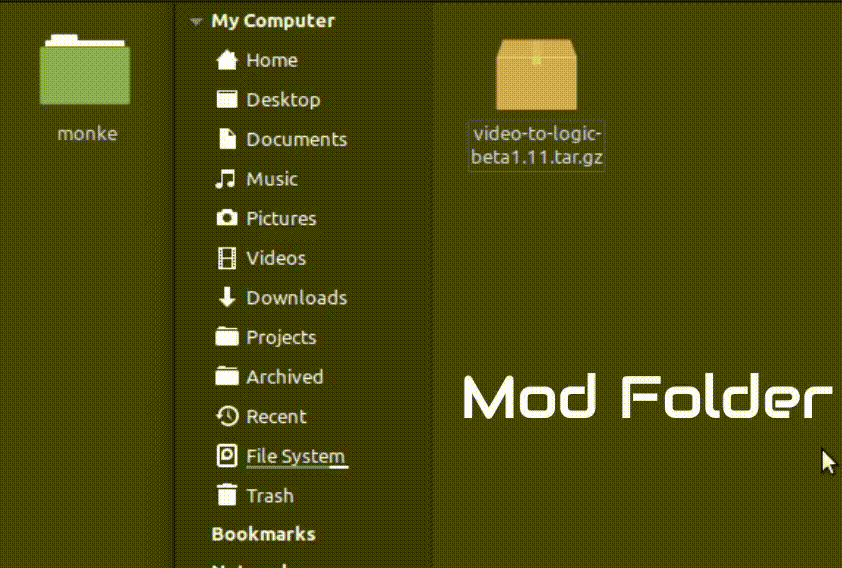
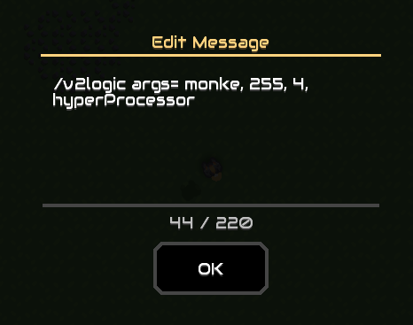

This mod is currently discontinued and may be rewritten in the future.

  
[Download the latest release.](https://github.com/ElectricGun/video-to-logic/releases/latest)  
# Changelog:
* Added *noLock* to config processor. Set to 1 to allow processing large frames on multiple processors
  
## Coming (not) soon:
* Framebuffer
* Real time editing
  
# About:
Converts a sequence to a Mindustry logic display animation    
Dependencies:   
[electricgun/message-block-commands](https://github.com/ElectricGun/message-block-commands)

## How to use:
0. Use the [video converter script](https://github.com/ElectricGun/video-converter/releases/latest "Video Converter") to convert a video into a usable format (or create your own script, output format must be the same)    
1. Install electricgun/message-block-commands    
2. Copy the output of the video converter into the animations folder in the mod directory. You might need to unzip the mod folder first    

3. Place down a message block on a Sandbox World    
4. Type "/v2logic args= **(medianame)**, **(maxCol**), **(scale)**, **(processorType)**" into the message block, where  **- (medianame)** is the name of your sequence folder in the animations folder,   **- (maxCol)** is the max number of "draw color"s per adjacent colours. Higher values lead to a smaller scheme size,   **- (scale)** is the scaling factor   **- (processorType)** is the type of the processors (in camelcase e.g. worldProcessor)     Example command:   
    
5. Exit out of the message block gui (this will lag for a few moments).    
6. Wait for it to finish, building the processors might take a while depending on your CPU and the overall size of the sequence    
7. Exit the world and rejoin to refresh the processors    
8. Edit the config processor (the microprocessor to the right of the clock processor) to your liking    

9. Activate the switch to play.    
## Important: 
- If your animation is very crusty and choppy, the instructions per tick may be too high. Consider lowering it to about 750, or disable *forceRender* in the config processor.
- The processors will overwrite blocks around the main display, only use this mod on **disposable sandbox worlds**, you can then save it as a scheme after it's done  
- The *ipt* variable only works on world processors, obviously  
- Multiprocessing is currently not supported to reduce crust, large animations are very slow unless you use world processors or cheating the ipt of regular processors up. Might give the option to enable multiprocessing if you really don't mind the crust  
- Config file directory: data/config.hjson  
 
The mod itself doesn't work on multiplayer, but the schematics should.
